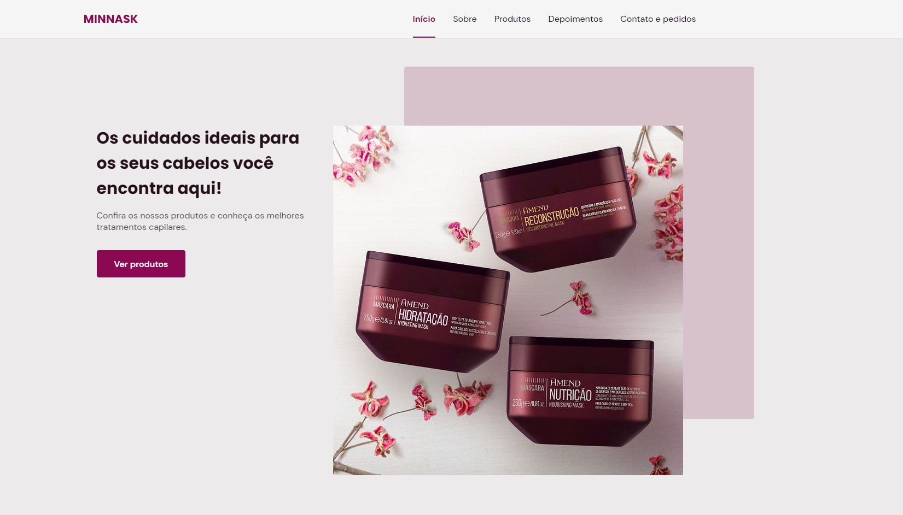
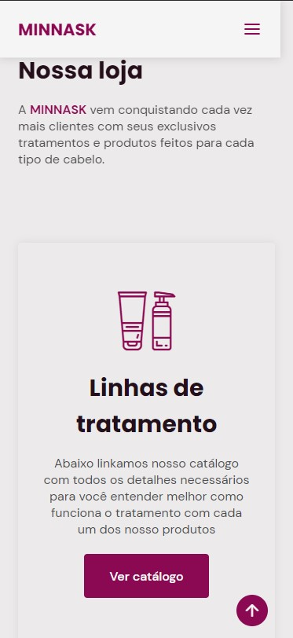

# Minnask website

## _Hey devs!_

I made this website with some skills learned in rocketseat courses, and i decided to use this skills to keep practicing and also help my girlfriend too!
She started a new business selling hair care products, so this website came at a great time since it is helping to promote the products.

It's a simple site, singlepage, but it has some cool tools!

### Features
- ScrollReveal.js
- Swiper.js
- Scss
- Mobile first! :D

The website is also very flexible and it can be used for many small businesses, since it is very easy to change his layout and colours - all you need to is replacing one scss var and the entire website colours and identity will change! 

## How to view

You can simply download all the files and open the .html file, or you can check it on gitpages: https://stepanenkocript.github.io/minnask_website/

Hope you like it! <3

